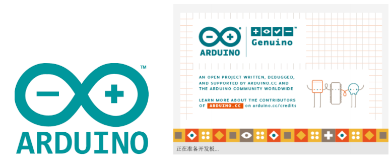

# Arduino
 

# What is Arduino?
**Arduino** is an easy-to-use open source electronic prototype platform that includes hardware (various Arduino-compliant development boards) and software (Arduino IDE and related development pakages).  
The hardware (or called development board) consists of a microcontroller (MCU), flash memory (Flash), and a set of general-purpose input/output interfaces (GPIO), etc. You can understand it as a microcomputer motherboard.  
The software is mainly composed of Arduino IDE on the PC side, related board support packages (BSP) and rich third-party function libraries. Using Arduino IDE, users may easily download the BSP related to the development board you have and the required function library for writing your program. 

## What can the MyCobotBasic library do?
MyCobotBasic library is an open source robot control library developed by our company, which can be used only after using the robot developed by our company. Using this library, you can control our robot through Bluetooth, WiFi, serial port, etc. It also supports functions such as external sensors, IIC communication, and LED lights. You can DIY different application scenarios according to your own needs, or you can refer to the MiniRobot sample code or control cases such as angles, coordinates, and grippers we provide. The MiniRobot sample code includes Bluetooth, WiFi, drag teaching, distance sensor and other control-related content.

**Applicable equipment:** 

- myCobot 280
  - myCobot 280 M5
  - myCobot 280 for Arduino  
- myCobot 320
  - myCobot 320 M5  
- myPalletizer 260
  - myPalletizer 260 M5 
- mechArm 270  
  - mechArm 270 M5 

Preconditions for use 
- **M5** series version， the bottom **M5Stack-basic** is programmed to miniRobot , select the  **Transponder** function, and the end **ATOM** is programmed to the latest version of atomMain (the factory default has been programmed)

