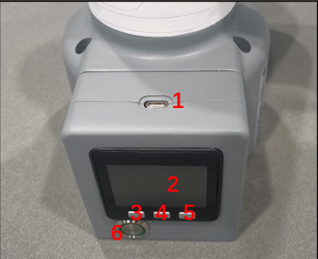
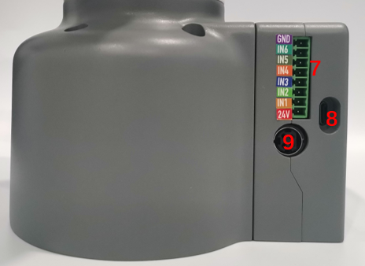
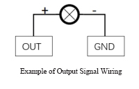
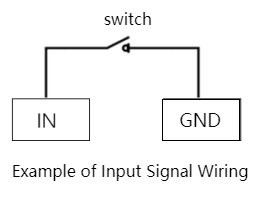
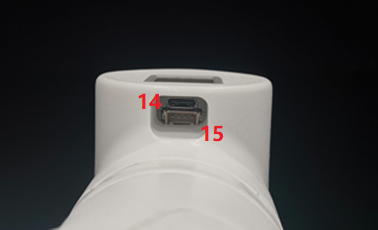
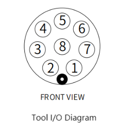

# Electrical characteristic parameter

## 1 Base electrical interface overview 

Figure 1 Front view of a base

Figure 2 Left side of the base

Figure 3 Right side of the base

| Number | Interface    | Definition | Function         | Remarks         |
|------|----------------|-----------|-------------------|------------------|
| 1    | Type C         | Communication Interface | Communicate with PC | development use |
| 2    | screen         | displaying | Use with buttons  |                  |
| 3    | button         | button A   | Use with the display |                  |
| 4    |                | button B   |                   |                  |
| 5    |                | button C   |                   |                  |
| 6    | switch         | 电源开关  | 控制输入电源通断  | 带灯（通电灯亮） |
| 7    | DC/IO interface | GND       | GND               |                  |
|      |                | IN6       | Digital input signal 1~6 | Input only in NPN mode |
|      |                | IN5       |                   |                  |
|      |                | IN4       |                   |                  |
|      |                | IN3       |                   |                  |
|      |                | IN2       |                   |                  |
|      |                | IN1       |                   |                  |
|      |                | 24V       | DC24V             |                  |
| 8    | Type C         | Communication Interface | Communicate with PC | development use |
| 9    | Power DC input interface | DC24V input | DC24V input |                  |
| 10   | DC/IO interface | 24V       | DC24V             |                  |
|      |                | OUT1      | Digital output signal 1~6 | output only in PNP mode |
|      |                | OUT2      |                   |                  |
|      |                | OUT3      |                   |                  |
|      |                | OUT4      |                   |                  |
|      |                | OUT5      |                   |                  |
|      |                | OUT6      |                   |                  |
|      |                | GND       | GND               |                  |
| 11   | Emergency stop interface | STOP      | Emergency stop circuit interface |                  |

#### 1.1 Type C ：Type C interface is used to connect and communicate with the PC, available for developers.

#### 1.2 Screen ：Screen is used to display the communication status of myCobot and calibrate the robot move to starting point with a 2-inch IPS screen.

#### 1.3 Button A, Button B and Button C is used to work with the screen in a coordinated way.

#### 1.4 Power switch ：Power switch is used to control the main power input. If it is switched off, the controller is also powered off.

#### 1.5 24V output ：Internal DC24V, available for users.

#### 1.6 Digital input/output: includes 6 digital input signals and 6 digital output signals for interaction with other devices, and together with other devices constitute an important part of the automation system.

Built-in I/O power supply, voltage 24V, single output maximum 0.2A. External power supply is not supported.

It should be noted that the output signal is in PNP form, and the input signal is in NPN form. The following is the external wiring diagram:

#### 1.7 Power DC input interface : It uses KPPX-4P R7BFDC power socket. The 24V 9.2A DC power adapter provided by the manufacturer can also be used to power myCobot320.

#### 1.8 Emergency stop circuit terminal is connected to the emergency stop button box, which can be used to control the emergency stop of the robot.

>  **Notice**: The emergency stop switch must be connected when the robot is in use, and make sure that the emergency stop switch circuit is always connected.

## 2 Electrical Interface at the end of the Robot Arm

Figure 4 Side view of the end of the robot arm

Figure 5 Side view of the end of the robot arm

| Number | Interface    | Definition | Function         | Remarks         |
|------|----------------|-----------|-------------------|------------------|
| 12   | M8 aviation socket | End tool IO interface |  interface	Interact with external devices |                  |
| 13   | Atom       | Led + button | Status view/drag to teach |                  |
| 14   | Type C     | Communication Interface | Communicate with PC | Update Atom firmware using |
| 15   | Grove      |                |                   | developers use |

#### 2.1 End-tool IO interface: This is a tool I/O diagram, and the myCobot 320 robot provides one input and two outputs.

Built-in I/O power supply, voltage 24V, single output maximum 0.2A. External power supply is not supported.

The definition of each tool I/O port is shown in the following table. It should be noted that both the input and output of the tool I/O are PNP types, and the wiring mode is the same as the bottom output interface.

| Number | Signal | Explanation             | Matchable Color of M8 Line |
| ------ | ------ | ----------------------- | -------------------------- |
| 1      | GND    | DC24V negative pole     | White                      |
| 2      | OUT1   | Tool output interface 1 | brown                      |
| 3      | OUT2   | Tool output interface 2 | green                      |
| 4      | 485A   | reserved, undeveloped   | yellow                     |
| 5      | 24V    | DC24V positive          | Ash                        |
| 6      | IN1    | Tool input interface 1  | pink                       |
| 7      | IN2    | unavailable             | blue                       |
| 8      | 485B   | reserved, undeveloped   | purple                     |

#### 2.2 Atom：Atom is used for 5X5 RGB LED to display the state of the robot arm and key function (used when the robot performs the drag teaching)

---

[← Previous Page](../2.1_320_M5_product/2.1.3-MechanicalStructureParameter.md)| [Next Page →](../2.1_320_M5_product/2.1.5-CoordinateSystem.md)