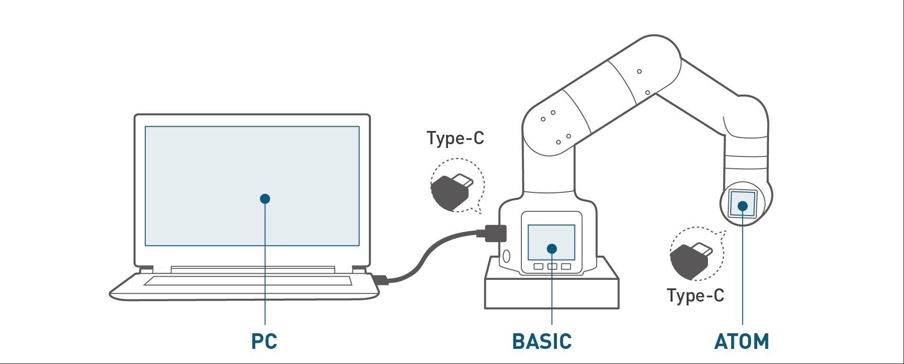

# Unpacking and the First-Time Use

## 1 Unpacking and Working Environment

> **Notice:** Before using, check the packaging first. If there is any damage, please contact with the logistics company and the supplier in your area in time. After unpacking, please check the total items according to the item list.

Table 2-2 myCobot Robot Arm [Standardized Set]

| Items[Standard Set] | **-Robot arm (myCobot 320 model M5 )** **-Product Manual -Power Supply-USB -Type C -Jumper **-**Pedestal** |
| ------------------- | ------------------------------------------------------------ |

Operate the robot only for applications that meet the conditions listed in the table below.

Table 2-3 Working Environment and Conditions

| **Working environment**          | **Condition**                                                |
| -------------------------------- | ------------------------------------------------------------ |
| Temperature                      | -10°C~45°C                                                   |
| Relative Humidity                | 20%~70%                                                      |
| Space Requirements               | Indoor                                                       |
| Other Environmental Requirements | - Avoid direct sunlight exposure.  - Avoid getting dust, oil fume, salt, iron filings, water etc on robot.  - Avoid flammable and corrosive liquids and gases.  - Avoid shock and vibration, etc.  - Avoid strong electromagnetic interference sources. |

## 2 Installation Requirements

myCobot weights 3.3 kg. Due to the fact that the center of gravity will change along with the movement of the robot during utilization, robot is required to be fixed on a solid base at the beginning. A fixed base, or mobile base are both acceptable.

#### Base Interface Size

* The base fixing holes act as the interface between robot and other bases or planes. The specific hole size is shown in the figure below. There are 4 countersunk holes with a diameter of 4.5 mm, which can be fixed with M6 bolts.

- The end is mounted with flange and is compatible with both LEGO component holes and screw threaded holes. Please make sure that there are corresponding threaded holes on the fixed base before installing.

#### *Before the installation, please confirm:*

- The environmental condition meets the requirements listed in Section 2.2.1.3.1 above.

- The installation position is no smaller than the working range of the robot, and there is enough space for installation, use, maintenance and repair.

- Put the base in a suitable position.

- Installation-related tools are prepared, such as screws, wrenches, etc.

- After confirming the above, please move the robot to the base installation table, adjust the robot position, and align the fixing holes of the robot base with the holes on the base mounting table. After aligning the holes, align the screws with the holes and tighten them.

  > **Notice:** When adjusting the position of the robot on the base installation table, do not pushing or pulling the robot directly on the base installation table to avoid scratches. When manually moving the robot, do not applying external force to the fragile parts of the robot body, so as to avoid unnecessary damage to the robot.
  >
  > **For more installation details, scan the code to watch the video:**
  >
  > 

## 3 Power on the Robot

Before operation, confirm that you have read **Chapter 1 Safety Instructions** to ensure safe operation. At the same time, connect the power adapter with the robotic arm, and fix the base of the robotic arm on the table. The connection method is shown in Figure 3-1.

​																									 

Figure 3-1 Location of the power connector

myCobot must be powered on with an external power supply to provide sufficient power:

- Rated voltage: 24V

- Rated current: 9.4A

- Plug Type: R7B

  

**Note that you cannot just use the TypeC plugged into the M5Stack-basic for power.** Use an officially adapted power supply to avoid damage to the robotic arm.

The use case diagram is shown in the following figure: (Please carefully align it with the use case diagram for connection)

    

 

 

## 4 Driver Installation

Users can download the corresponding CP210X or CP34X driver according to the operating system they are using, and after decompressing the compressed package, select the installation package with the corresponding operating system digits for installation.

There are currently two driver chip versions, CP210X (applicable to CP2104 version) / CP34X (applicable to CH9102 version) driver package. If you are not sure which USB chip your device is using, you can install both drivers at the same time.

**Scanning the QR code for installation information:**

## 5 Connecting with PC via USB

Figure 3-2 Schematic diagram of the USB interface

1) Use Type-C cable to connect with PC and the corresponding USB interface of the robotic arm M5Stack-basic, and then check the connection. Connection detection is a function to check the connection status of the motors and Atoms, making it easy for customers to troubleshoot the robot.

*Refer to MyCobot-320 for M5 Product Manual-3.4.3 Status Query Teaching for more information about detection function.*

2. After successful connection, the communication forwarding detection can be performed. As commands is send to the M5Satck-basic of the base,immediate transponder is of great importance for the microcontroller manipulator.  The end effector will parse the commands and then execute the target action with the aid of transponder.

*Refer to **MyCobot-320 for M5 Product Manual-3.4.4 Communication Forwarding Teaching** for more information.*

### Unboxing vedio

<video id="my-video" class="video-js" controls preload="auto" width="100%"
poster="" data-setup='{"aspectRatio":"16:9"}'>
  <source src="https://static.elephantrobotics.com/wp-content/uploads/2022/04/%E8%8B%B1%E6%96%87%E7%89%88320%E5%BC%80%E7%AE%B1END2.mp4"></video>