# 系统使用说明


## 5.1.1 机器人系统介绍

**系统**

- Ubuntu 是个人桌面操作系统中使用最广泛的 linux 操作系统。对于初学者来说，熟悉 linux 环境或一些嵌入式硬件操作系统是一个不错的选择。ubuntu 官方网站还发布了树莓派（Raspberry PI）专用操作系统。

  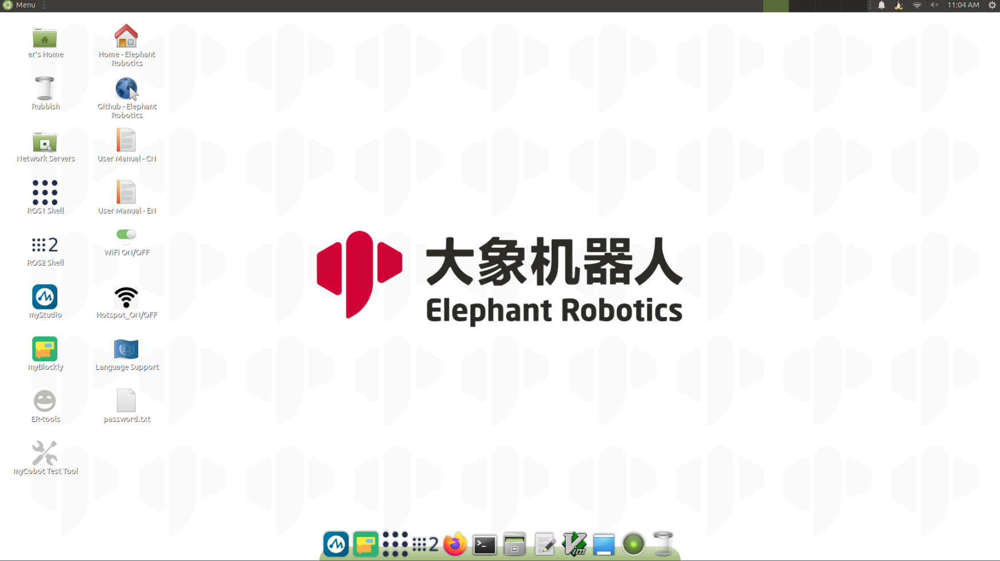

- **功能介绍**

  - **myStudio**：固件刻录软件，用于更新和刻录新固件。

  - **myBlockly**：图形化编程软件，可直接通过拖动构件形成运行代码，控制机械臂。

  - **ROS1 Shell**：直接进入编译后的 ROS1 环境，可以直接输入相应指令，运行相应的 ROS1 代码。

  - **ROS2 Shell**：直接进入编译后的 ROS2 环境，可以直接输入相应指令，运行相应的 ROS2 代码。

  - **Github-ElephantRobotics**：大象机器人官方开放源代码库。

  - **Home-ElephantRobotics**：大象机器人网站。

  - **UserManual - CN/EN**：机器人使用手册，包含有关机器人控制的所有内容。

  - **WiFi_ON/OFF**：WiFi 开关，点击可打开/关闭 WiFi 功能。

  - **HotSpot_ON/OFF**：热点开关，点击可打开/关闭热点功能，热点名称为**ElephantRobotics_AP_XXXX**。
  - **Language Support**：系统语言设置，点击进入系统语言设置界面。

## 5.1.2 系统密码说明

- **账户密码、VNC 密码、SSH 密码、root 账户密码**

  - 密码：**Elephant**

- **如何更改密码**

  - 更改账户密码

    - 使用快捷键 `ctrl + alt + T` 打开终端
    - 输入 `passwd`
    - 输入新密码两次

  - 更改 vnc 密码

    - 使用快捷键 `ctrl + alt + T` 打开终端
    - 输入 `vncpasswd`
    - 输入新密码两次

  - 更改 ssh 密码

    - 对于 SSH 远程连接，需要输入管理员账户的密码。无需单独更改密码

  - 更改 root 帐户密码

    - 使用快捷键 `ctrl + alt + T` 打开终端
    - 输入 `sudo passwd`
    - 输入新密码两次

## 5.1.3 VNC

- **VNC 简介**

  - 是一种远程控制软件，一般用于远程解决计算机问题或软件调试.

- **VNC 端口**

  - 当机器人手臂和电脑连接到同一个 WiFi 时，机器人手臂的 IP 地址为端口.

- **连接 VNC**

  - 有两种无线连接模式。第一种模式需要外接显示器对系统进行一些操作。具体步骤如下: 点击 **“Disconnect”**，断开默认热点连接

    

    点击 **"Enable Wi-Fi"** ，此时将显示当前可用的 WiFi

    

    点击需要连接的 WiFi，输入密码

    

    连接成功后，点击 **"Connection Information"** 检查机器人的 IP 地址

    

    如示例所示，**“192.168.10.64”** 是机器人当前的 IP 地址

    

    将电脑和机器人连接到相同的 WiFi 上，打开 VNC 查看器，输入 IP 地址（例如：输入 **192.168.10.64**），然后点击 "确定"。输入密码 **Elephant**，默认情况下不指定用户名。以下是连接成功的示例：

    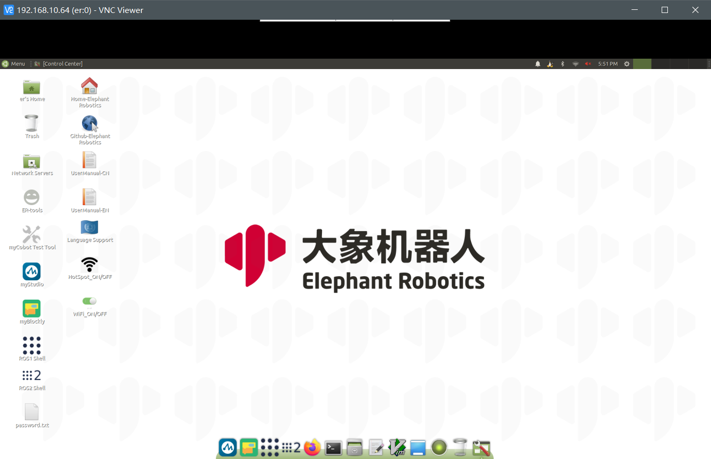

  - 第二种方法不需要连接显示器，直接将 Ubuntu 系统热点与 PC 机连接进行远程控制，但这种连接方式不具备上网冲浪的功能，只能远程控制机械臂系统。具体步骤如下：

    连接热点 **ElephantRobotics_AP_XXXX**输入密码 **Elephant**

    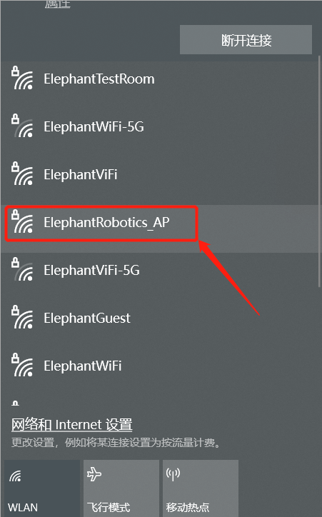

    打开 VNC 查看器，输入 IP 地址 **10.42.0.1** ，回车，然后输入密码 **Elephant**，默认情况下不指定用户名。下面是一个成功连接的示例： 用户名

    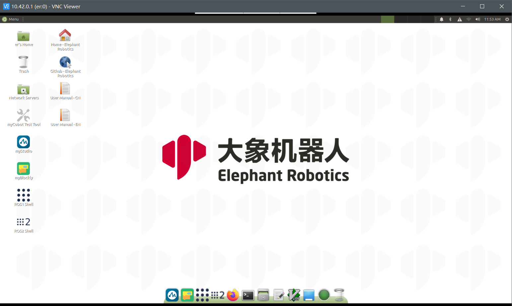

- **如何提高连接流畅性**
  - 远程连接的流畅性取决于所连接 WiFi 的流畅性。建议连接稳定的 WiFi 进行远程控制

## 5.1.4 SSH

- **SSH 简介**

  - SSH 是一种网络协议，用于计算机之间的加密登录。如果用户使用 SSH 从本地计算机登录到另一台远程计算机，我们可以认为这次登录是安全的，即使中间被拦截，密码也不会泄露。

- **SSH 端口**

  - 默认端口号为 22

- **SSH 连接**

  - 请按照以下说明确认机器人的 IP 地址 **5.1.2 VNC**

  - 点击 `win + R` 并输入 `cmd`  
    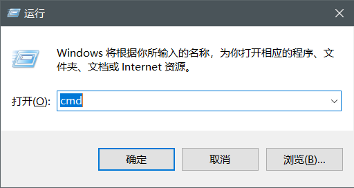

  - 输入后，单击 "确定 "打开外壳界面
    

  - 输入 "ssh er@IP address"，然后按 "Enter"（IP 地址主要由机械臂显示，图中仅为示例）。
    

  - 输入密码 `Elephant`
    

  - 如上图所示，机械臂已通过 ssh 成功连接

- **如何提高连接流畅性**

  - 远程连接的流畅性取决于所连接 WiFi 的流畅性。建议连接稳定的 WiFi 进行远程控制。

## 5.1.5 网络配置

- **默认 AP 使用情况**

  - 打开机器人电源，默认情况下，系统会连接到 PI 自带的热点，热点名称为**ElephantRobotics_AP_XXXX**，当前 IP 地址为**10.42.0.1**，该热点不具备网上冲浪功能，且传输速率和信息量有限，因此最终成像会有一定的失真和色差，通信传输也会有延迟，属于正常现象。

- **连接至无线局域网**

  点击 **"Disconnect"**， 关闭默认热点

  

  点击 **"Enable Wi-Fi"**，等待显示当前可用的 WiFi

  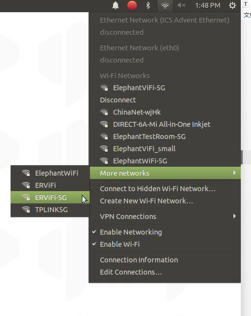

  单击要连接的 WiFi 并输入 WiFi 密码

  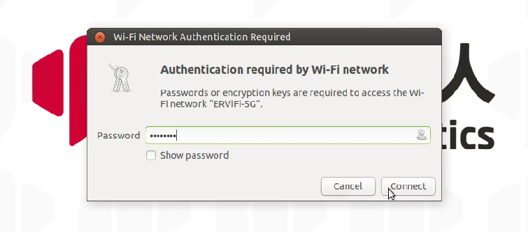

  连接成功后，点击 **"Connection Information"** 检查 IP 地址

  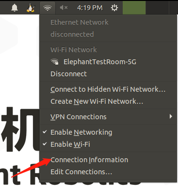

  如示例所示，**“192.168.10.64”**，是机器人当前的 IP 地址

  

  **有线网络连接**

  打开机器人电源，机器人默认连接到系统配置的热点：

  **ElephantRobotics_AP_XXXX**

  

  点击 **“Disconnect”**，从默认热点断开连接

  

  将网线连接到机器人的网络端口

  

  将网线连接到机器人的网络端口

  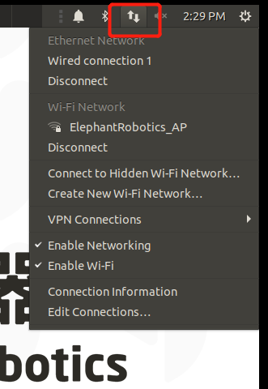

  **如何设置默认 IP 地址**

  使用快捷键`ctrl + alt + T`打开终端，输入`sudo vim /etc/netplan/01-network-manager-all.yaml`，修改 01-network-manager-all.yaml 文件如下：

  

  修改后，输入`sudo netplan apply` 使配置生效

  **如何自动分配 IP 地址**

  如果要将固定 IP 地址改为自动分配 IP 地址，请按如下步骤修改 /etc/netplan/01-network-manager-all.yaml 文件：

  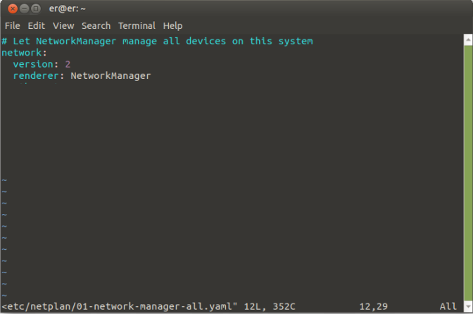

修改后，输入`sudo netplan apply` 使配置生效

## 5.1.6 BT 配置

- T 系统的蓝牙功能默认已打开。直接使用电脑/手机，即可搜索机器人的 BT。BT 的默认名称为**MyCobot-Pi**。

  

  从电脑/手机向机器人系统传输文件

  - 选择要传输的文件

  - 在机器人系统中操作，点击**Accept**接收文件

    

  - 等待 BT 传输完成

    

  - 可在 **/home/er/Downloads** 文件夹中查看收到的文件

    

- 从机器人系统向电脑/手机传输文件

  - 点击 BT 图标，选择 **Send Files to Device**

    

  - 选择 PC/Phone

    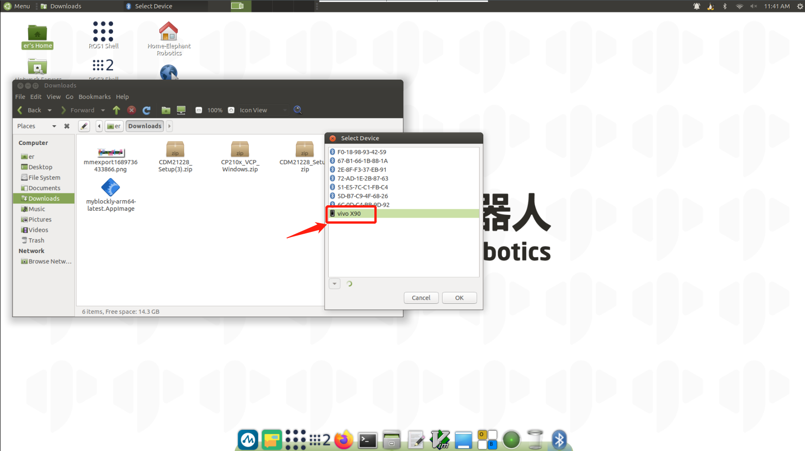

    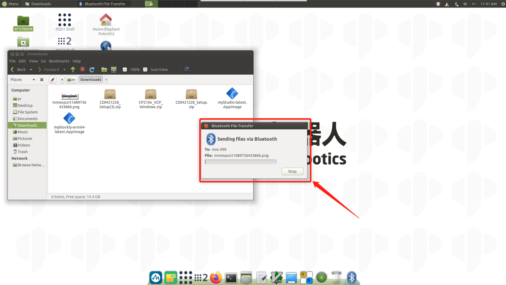

  - 在电脑/手机上，允许设备接收文件
    

## 5.1.7 语言配置

**如何更改语言**

点击 **Language Support**，将所需语言拖到顶部，然后重新启动系统


**如何下载语言**

点击 **Language Support**，选择语言，点击下载，输入密码 **Elephant**


## 5.1.8 系统分辨率开关

点击 屏幕右上角的图标，然后选择 **System Settings** 进入控制面板

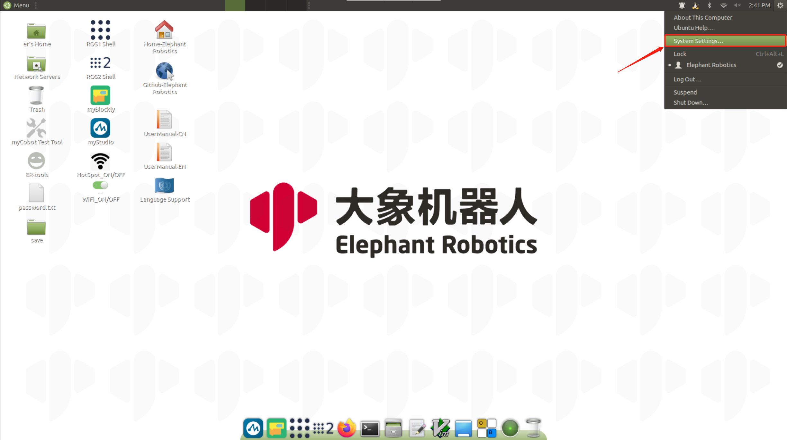


选择 **Display**


切换所选分辨率，然后单击 **Apply** 进行检查，然后点击 **Keep this Configuration** 保存配置


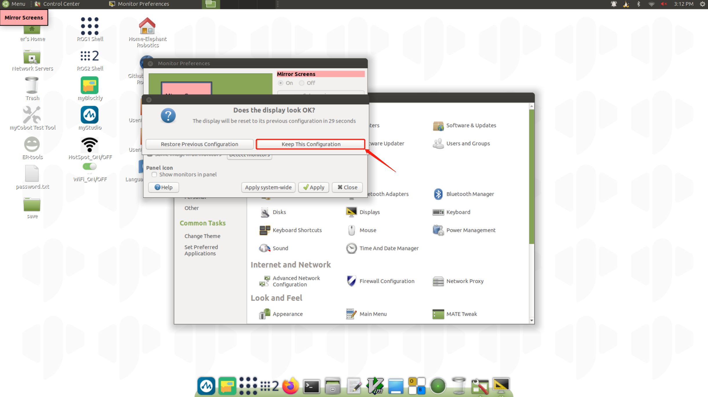

## 5.1.9 python

- **Python 简介**

  内置安装 **Python3.8** ，无需自行安装

  已安装的库：

| **Package**           | **Version** |
| :-------------------- | :---------- |
| pymycobot             | 3.1.5       |
| pyserial              | 3.5         |
| numpy                 | 1.23.5      |
| opencv-contrib-python | 4.7.0.72    |
| rospkg                | 1.4.0       |
| rospkg-modules        | 1.4.0       |

- **尝试编程**

  如果你是 python 编程语言的新手，可以按照以下视频进行编程

<video id="video" controls="" src="../../../resources/5-BasicApplication/5.1/5.1.9-1.mp4" preload="none"></video>

<video id="video2" controls="" src="../../../resources/5-BasicApplication/5.1/5.1.9-2.mp4" preload="none"></video>

您可以在以下输入字段中试用此代码：

```python
  print ("Hello World!")
```

- **运行演示**

  可查看具体的案例代码[Python](../../../10-ApplicationBasePython/README.md)，只需复制案例中的代码并使用即可

---

[← 基础功能页面](../../../5-BasicApplication/README_PI.md) | [下一节 →](../../5.2-ApplicationUse/myblockly/320pi/1-myBlocklyFirstUse.md)
